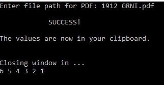

# PDFScraper
My brother was copying and pasting hundreds of values off a pdf every month for his work. He would snag the vendor's name and a dollar amount associated with that vendor. He reached out for a way to automate the copying process. This program is the result of his request.

He simply provides the path file to the pdf. The program terminates when finished, with the desired values placed in his clipboard ready to be pasted anywhere. 

Using [auto-py-to-exe](https://pypi.org/project/auto-py-to-exe/), I converted the .py file into an .exe file that he could run on his computer without needing to install python or any packages. 

This program has saved him a quite a bit of brain numbing time each month allowing him to focus on the more important parts of his job.
